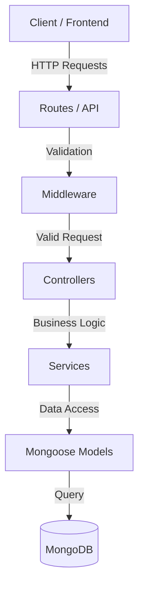

# Animal Clinic Backend API

REST API developed in Node.js and TypeScript to expose pet data for Animal Clinic.
This application uses **MongoDB** as the database.

## Architecture

The project follows a layered architecture to ensure separation of concerns and maintainability.



*   **Routes**: Define the API endpoints and delegate requests to controllers.
*   **Middleware**: Handles request validation (e.g., input checking).
*   **Controllers**: Manage the HTTP request/response cycle.
*   **Services**: Contain the core business logic and interact with the database layer.
*   **Models**: Define the data structure (Schema) and interact with MongoDB.

## Docker Containers

The project uses Docker Compose to orchestrate the following services:

*   **api**: The Node.js/Express backend application. Exposed on port `3000`.
*   **mongo**: The MongoDB database instance. Exposed on port `27017`.

## Database Seeding

To facilitate development, the project includes a seeding script that populates the database with initial dummy data (50 pets). This ensures you have enough data to test endpoints like pagination, filtering, or statistics immediately.

To run the seed:

1.  Ensure the database is running (e.g., via `docker-compose up`).
2.  Run the following command:

```console
npm run seed
```

*Note: This will clear existing pets and insert new random data.*

## Running the Application locally:

Features to keep in mind if you want to run the app in a local environment:

* Application built with Node version - v14.21.2 (or higher)
* Dependency manager npm version - 6.14.17 (or higher)
* **MongoDB**: You must have a MongoDB instance running locally (default at `mongodb://localhost:27017/animalClinic`).

Commands to execute:

```console
npm i
npm start
```

## Running the Application with Docker (Recommended):

This is the easiest way, as it spins up both the API and the MongoDB database automatically.

Prerequisites:
* Have docker-compose and docker installed.

To start the containers, run in the project root:

```console
docker-compose up --build
```

This will start:
1. The API at `http://localhost:3000`
2. A MongoDB database on port `27017`

_Note: If you want to access the container's file system to verify logs, for example, execute:_

```console
docker exec -it api /bin/bash
```

## Application deployed on a public server:

Url -- [Animal-Clinic-api](https://api-animalclinic.onrender.com).

## Endpoints

The REST API has the following endpoints:

* `GET /pets` - Retrieves all registered pets.

* `GET /pets/:id` - Retrieves information for a specific pet. **Note:** The `id` is now a MongoDB ObjectId (string).

* `GET /pets/species/most_numerous_species` - Retrieves the most numerous pet species.

* `GET /pets/species/average_age?species_name='example'` - Retrieves the average age of pets of the required species.

* `POST /pets` - Registers a new pet.
    * `name` (string, required): Name of the pet.
    * `species` (string, required): Species of the pet.
    * `gender` (string, required, must be "male" or "female"): Gender of the pet.
    * `birthdate` (string, required, format "YYYY-MM-DD"): Birthdate of the pet.   

* `GET /health` - Health check to verify the service is up.

* `GET /api-docs` - Swagger documentation to test the endpoints.

## Unit Tests

To run the unit tests:

```console
npm test
```
